# QR CODE:
## Version
There is no one size fits all kind of QR so we use different versions of QR to fit different amount of information the capacity of QR increases with the version,

### For Example:

| Version | Grid | Capacity |
|:-----------|:------------:|------------:|
| Version 1 | 21x21 | 441 bits |
| Version 2 | 25x25 | 665 bits |
| Version 40 | 177x177 | 31329 bits |

The Latest Version of standard QR is Version 40 with 177x177 grid that can hold upto 31329 bits which would average around 3916 ascii character (a-z, A-Z, 0-9 && symbols).
But here's the thing, You can only store upto 1/3 or 1/4 of the capacity because the rest is used for other stuff which equally important as the actual data to make the
QR readable.

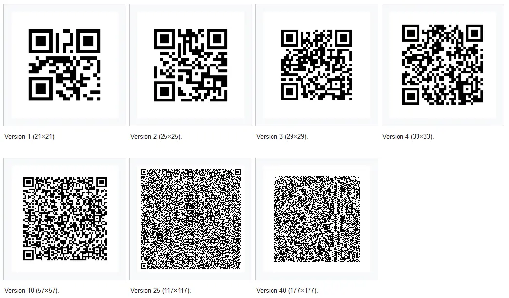

Now let's talk about the standard format of the QR:

## Modules 
It is the fundamental unit of QR Code and blocks are used to generate the QR, normally you would see white and black modules but that is not mandatory as you could make them any colour as far as they are distinguishable
from each other. For simplicity we use black and white because they contrast well

## Quiet Zone
Around the actual QR there should be a blank space/zone so that there is no problem scanning it, According to the standards it should be 4 modules thiccccc

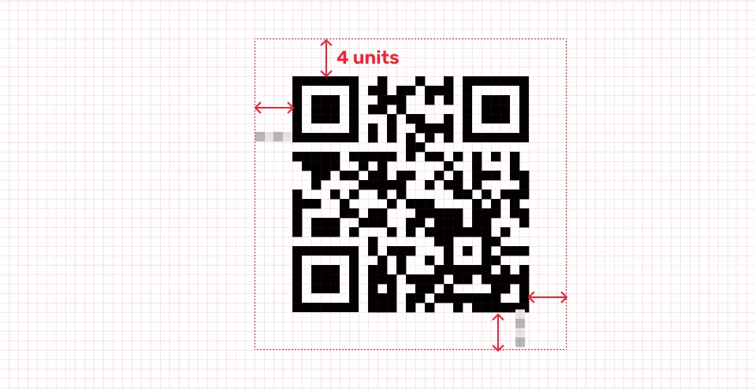

## Position Detection Pattern / Finder Pattern 
There are 3 square like markers placed on 3 of the 4 corner.
Position Pattern helps the scanner to figure out orientation of the QR 

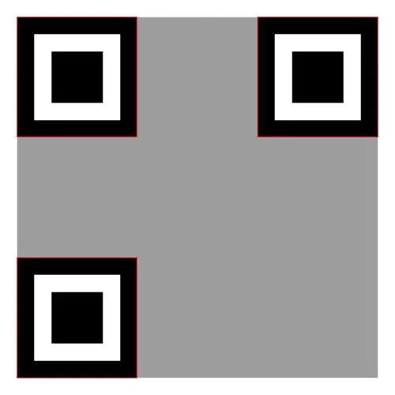

### Seperator
Position Detection Pattern has a white stripe around it which seperates the position detection squares from 
rest of the QR code info.

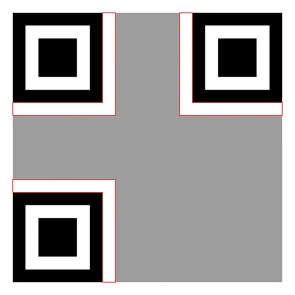

## Alignment Pattern 
It helps rescale the qr code to a perfect square if scanned from a weird perspective.

It is similar to Position Pattern but is relatively smaller and is placed according to the version of the QR used, 
every version of qr has alignment pattern except version 1, There can be single or multiple alignment pattern based on the version used.

## Timing Squares
-> It helps define the version of the qr code.
If there are 5 alternating squares then it is version 1 and if there's 9 it's version 2

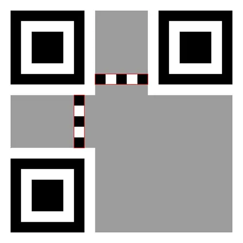

## Format Information
There are 15 bits in Format Infomation,
It occupies space adjacent to the border of the position squares. It defines how the data should be read.
It has Several Parts:

### ECC Level (Error Correction Level) 
If you are observant then you would have noticed that even when the QR is slightly damaged it still works thanks the to the ECC Algorithm
There are 4 Types of ECC level used in QR:
| Level | % Restorable |
|:-----------|:------------:|
|L (Low) | 7% of data bytes can be restored. |
|M (Medium) |	15% of data bytes can be restored. |
|Q (Quartile) | 25% of data bytes can be restored. |
|H (High)	| 30% of data bytes can be restored. |

It is defined in the first 2 

- 11 -> L
- 10 -> M
- 01 -> Q
- 00 -> H

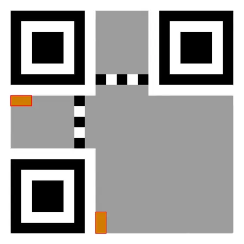

### Mask Pattern
- First Copy

After the ECC level the next 3 bits defines the masking pattern used.

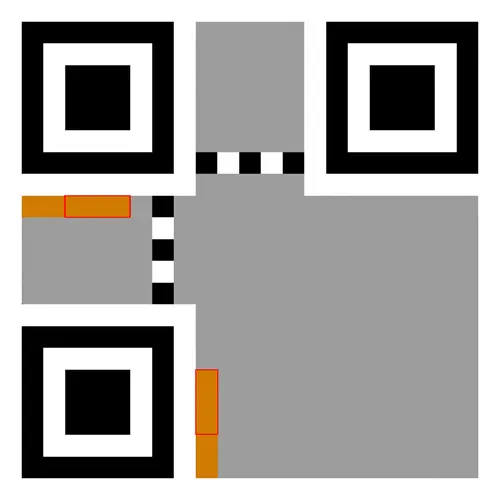

So what is a masking pattern:
so when you place the modules according to the data there might be a puddle of same modules adjacent to each other which
gives a hard to time to the QR scanner figuring out that what it's looking at is even a qr or not so there are 8 different mask patterns used in the qr for jumbling the modules,
so we flip the bits in the matrix where the mask pattern holds true.

the final qr is passed through a penelty scoring system and whichever one is score the least (most jumbled), that is applied to the qr.

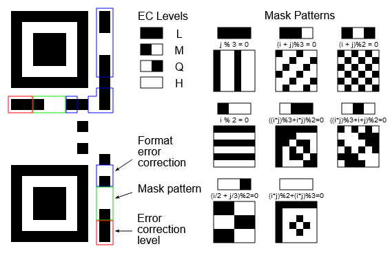

If you remember there are 15 bits in format info but as of now we have only defined 5 so what about the other 10 bits:
We pass the 5 bits to BCH (Bose–Chaudhuri–Hocquenghem), it is a type of encoding which generates a error correcting code.
After passing the first 5 bits through BCH we would have our 15 bits, out of which we would place the first 7 bits horizontally just below the top-left position pattern
and the last 8 bit on the right side vertically top to bottom

As of Now we have successfully stored the format info at the top-left position pattern but I told you that there are two 2 copies of format information so we store those at
the other two position pattern

- Second Copy

The first 7 bit are stored vertically bottom to top on the right side of the bottom-left position pattern,
the next 8 bit are stored horizontally right to left on the bottom of the top-right position pattern
after you have done that it would look like this:

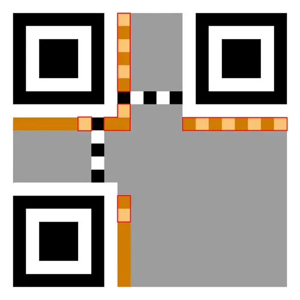

- Unused Bit
There is an unused bit which serves no purpose but is there for some reason obviously,
the (row=QR_SIZE - 8, col=8) is always a black bit or any other dark color you are using

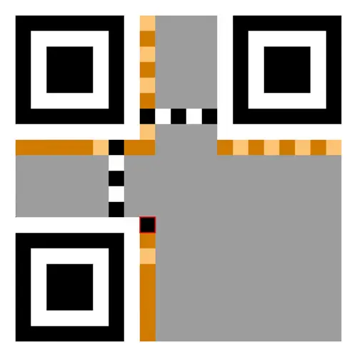

Now Time has come to finally store the actual data:

## Data Storage
Data is stored in binary in qr and data always start from the bottom right corner and the first 4 bit or squares specify the data format.
binary in QR is stored in a zig zag 2 column format making its way to the top left position square

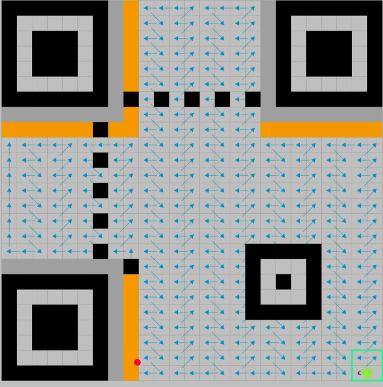

### There are 4 data formats used in qr codes
- (0001) Numeric
- (0010) Alphanumeric
- (0100) Binary
- (1000) Japanese Kanji

Following the data format segment there are 8 bits that specifies the number of character in the qr stored

### RSC (Reed Solomon Encoding)
If you remember We discussed the level of error correction, now we use the level and the actual data to feed it to the rsc encoding to generate error correction bits
which would help us recover data if the qr is partially damaged.

After That we will have all the bits that we'll place on the qr using the standard zig-zag 2 column format && then apply the mask with the lowest penalty score and boom...
QR is Generated

Adios Amigos,
Powering Off...
~Zalos
